# Weighbridge Management System — Product Manual

**Version 1.0.0** &nbsp;·&nbsp; Truck weighing, gate entry, plate recognition and Oracle integration

| | |
|---|---|
| **Prepared for** | &nbsp; |
| **Site** | &nbsp; |
| **Installed by** | &nbsp; |
| **Date** | &nbsp; |

---

## Contents

1. Introduction
2. System overview
3. What you need (hardware and software)
4. Installation
5. First-time setup (step by step)
6. Connecting the weighing scales (indicators)
7. Cameras and plate recognition (ANPR)
8. Gates and boom barriers
9. Oracle database integration
10. Daily operation — weighbridge operator
11. Daily operation — security gate
12. Reports, tickets and the ERP interface
13. Administration
14. Security
15. Troubleshooting
16. Appendices (settings reference, database, formats, checklists, glossary)

---

# 1. Introduction

The **Weighbridge Management System** records every truck that is weighed on your weighbridge(s), controls the gate barriers, and passes the completed records to your Oracle database. It replaces manual registers and paper slips with a single screen that the operator can learn in minutes.

**What it does**

| Area | Capability |
|---|---|
| Weighing | Reads the weight directly from the indicator (RS-232, RS-485, TCP or Modbus), accepts it only when **stable**, prints a weighment slip, keeps a permanent record. Two-pass (gross then tare, or tare then gross) or single-pass using a stored vehicle tare. |
| Several bridges | Any number of scales on one PC, each with its own port, settings and camera. A truck may be weighed in on one bridge and out on another. |
| Plate recognition | Optional. Reads the vehicle number from a camera, fills the form, and checks that the truck on the bridge is the truck on the ticket. |
| Gate entry | Register vehicles at the gate, print a gate pass, keep a live list of vehicles inside, block problem vehicles, control the exit. |
| Gate barriers | OPEN / CLOSE buttons for every boom barrier; barriers can open automatically when a weighing completes. |
| Oracle | Completed tickets are sent to your Oracle table automatically, safely and without duplicates, even if the network is temporarily down. |
| Control | Users and roles, audit trail, reports with CSV export, backups, a read-only interface for ERP systems. |

**Important limits**

* The system records what the **indicator** sends. If the weights are used for commercial billing, the indicator and weighbridge must be legally approved and sealed for trade in your country. This software does not replace calibration or statutory certification.
* The software sends only OPEN/CLOSE contacts to a barrier. **Anti-crush safety** (safety loop, photocell, limit switches, emergency stop) must be provided by the barrier hardware. See section 8.

---

# 2. System overview

```
 Weighing indicator ──RS-232 / RS-485 / TCP──►  Scale reader ──►  Local database  ◄──  Web screens
 (one per bridge)                                (one per scale)   (SQLite)             (any PC / tablet
                                                                        │              on the network)
 IP camera ──snapshot──► Plate recognition ─────────────────────────────┤
 Boom barrier ◄── relay / PLC ◄── Gate control ◄────────────────────────┤
                                                                        └──► Oracle database
```

The program runs on **one PC (the "weighbridge server")** next to the weighbridge. Operators use it from a web browser — on that PC, or from any other PC, laptop or tablet on the network. There are two background programs:

* **Scale supervisor** – starts a reader for every enabled scale, restarts it if it stops, and closes gates after their auto-close time.
* **Oracle sync** *(optional)* – sends completed tickets to Oracle every 30 seconds.

**Screens**

| Screen | Who | Purpose |
|---|---|---|
| **Weighing** | Operator | Live weight of each scale, create tickets, second weighment |
| **Gate** | Security | Gate OPEN/CLOSE, register vehicles, vehicles inside, exit |
| **Reports** | Everyone | Find tickets, totals, CSV, Oracle status |
| **Masters** | Everyone (delete/block: admin) | Vehicles (with stored tare), parties, materials |
| **Setup** | Administrator | Scales, gates, plate recognition, Oracle, company details, users, diagnostics |

**Roles**

| Can do | Operator | Administrator |
|---|:-:|:-:|
| Weigh, print slips, register vehicles, open/close gates, view reports | ✔ | ✔ |
| Add vehicles, parties, materials | ✔ | ✔ |
| Cancel a ticket or gate entry, delete master data, block vehicles | | ✔ |
| Override a blocked vehicle, plate mismatch or exit rule (reason is recorded) | | ✔ |
| Setup page, users, send to Oracle now | | ✔ |

---

# 3. What you need

## 3.1 Computer

| Item | Requirement |
|---|---|
| PC | Any modern PC or industrial PC, 4 GB RAM, 10 GB free disk. Windows 10/11, Windows Server 2016+, or Linux (Ubuntu 20.04+ / Debian 11+). |
| Runs 24×7? | Recommended: yes, with a UPS. The PC must be on for weighing and gate control. |
| Network | Needed for other PCs/tablets, cameras, network relays and Oracle. |

## 3.2 Software (installed by you or the integrator)

| Software | Notes |
|---|---|
| **PHP 8.1 or newer** | With extensions `pdo_sqlite`, `sodium`, `mbstring` (required) and `curl` (needed for cameras, plate recognition and HTTP gate relays). |
| Web browser | Chrome, Edge or Firefox (current). |
| Oracle client *(optional)* | PHP `oci8` extension and Oracle Instant Client, only for Oracle integration. |
| Plate recognition service *(optional)* | CodeProject.AI Server, Plate Recognizer, or OpenALPR. |

There is nothing else to install: no separate database server, no Composer, no Node.js.

## 3.3 Field hardware

| Item | Notes |
|---|---|
| Weighing indicator | Must have a serial output (RS-232 or RS-485) or a network gateway. Note its baud rate, data bits, parity and stop bits (typically 9600, 8, N, 1). |
| Cable / adapter | RS-232: TX, RX, GND (DB9 pins 2, 3, 5). USB-RS232 or USB-RS485 adapter if the PC has no COM port. RS-485: two wires A and B (D+ and D−) plus a 120 Ω terminator on long runs. |
| Serial-to-Ethernet gateway *(optional)* | For distances >15 m (RS-232) or when the PC is far from the bridge. |
| IP camera *(optional)* | Must provide a JPEG **snapshot URL**. One per scale and/or gate. |
| Boom barrier controller and relay *(optional)* | A dry-contact relay board or PLC output that can be wired to the barrier's OPEN/CLOSE inputs. IP relays, USB relay boards and Modbus relay modules are supported. |

---

# 4. Installation

Follow **either** 4.1 (Windows) or 4.2 (Linux). Then continue with section 5.

## 4.1 Windows

1. **Install PHP.** Download *PHP 8.2 or newer, Thread Safe, x64* (zip) from windows.php.net and unzip to `C:\php`.
2. **Enable extensions.** Copy `C:\php\php.ini-production` to `C:\php\php.ini`. Open it in Notepad and make sure these lines are present without a leading semicolon:
   ```
   extension_dir = "ext"
   extension=pdo_sqlite
   extension=sodium
   extension=mbstring
   extension=curl
   ```
   Add `C:\php` to the system **PATH** (Windows Settings → search "environment variables").
3. **Copy the program.** Copy the whole `weighbridge` folder to `C:\weighbridge`.
4. **Check the PC.** Open *Command Prompt* and run:
   ```
   cd C:\weighbridge
   php bin\check.php
   ```
   Every line must show `[OK]` (or a `[WARN]` you understand — for example "Oracle driver not installed" if you do not use Oracle). Fix any `[FAIL]` first.
5. **Quick test.** Double-click **`start.bat`**. Two windows open (readers and web server). Open `http://localhost:8080/` in the browser. Continue with section 5.
6. **Make it permanent (services).** Install *NSSM* (nssm.cc), edit the two paths at the top of `deploy\windows-install.bat`, and run it **as Administrator**. It creates three Windows services that start with the PC: *WeighbridgeScale* (readers), *WeighbridgeOracleSync* (Oracle transfer) and *WeighbridgeWeb* (screens). Close the `start.bat` windows first.
7. **Windows Firewall.** Allow inbound TCP port 8080 if other PCs will connect.

## 4.2 Linux (Ubuntu / Debian)

```bash
sudo apt update
sudo apt install -y php-cli php-sqlite3 php-mbstring php-curl nginx php-fpm   # or apache2 + libapache2-mod-php
sudo mkdir -p /var/www && sudo cp -r weighbridge /var/www/weighbridge
sudo chown -R www-data:www-data /var/www/weighbridge/data
sudo chmod 750 /var/www/weighbridge/data
sudo usermod -aG dialout www-data            # permission to use serial ports
cd /var/www/weighbridge && sudo -u www-data php bin/check.php
```

*Quick test:* `./start.sh` (opens the web server on port 8080 and starts the readers).

*Permanent:* 

```bash
sudo cp deploy/*.service /etc/systemd/system/
sudo systemctl daemon-reload
sudo systemctl enable --now weighbridge-scale weighbridge-oracle-sync
```

and publish `public/` with nginx/Apache. Example nginx site:

```nginx
server {
    listen 80; server_name weighbridge.local;
    root /var/www/weighbridge/public; index index.php;
    location / { try_files $uri $uri/ =404; }
    location ~ \.php$ { include snippets/fastcgi-php.conf; fastcgi_pass unix:/run/php/php8.2-fpm.sock; }
    location ~ /\. { deny all; }
}
```

**Important:** the web server must point at the **`public`** folder only. The `data` folder (database and key) must never be reachable from the web.

## 4.3 Folder contents

| Path | Contents |
|---|---|
| `public/` | The screens (the only folder the web server publishes) |
| `src/`, `bin/` | Program code and background programs |
| `data/` | **Your data**: `weighbridge.sqlite` (database), `app.key` (encryption key), `snapshots/` (camera photos), `logs/` (reader logs), `backups/` |
| `sql/oracle_schema.sql` | Oracle table script |
| `deploy/` | Service files for Linux and Windows |
| `docs/` | This manual, screenshots, comparison notes |
| `tests/` | Automatic self-tests |
| `VERSION`, `CHANGELOG.md` | Version information |

---

# 5. First-time setup (step by step)

## Step 1 — Installer page

Open `http://<server>:8080/install.php`. The page checks the PC (PHP version and extensions, writable data folder). Enter:

* **Company name** (printed on slips)
* **Administrator username and password** (at least 8 characters — keep it safe)

Press **Install**. The system starts with one **Simulator** scale, so you can try everything before connecting real hardware.

## Step 2 — Log in

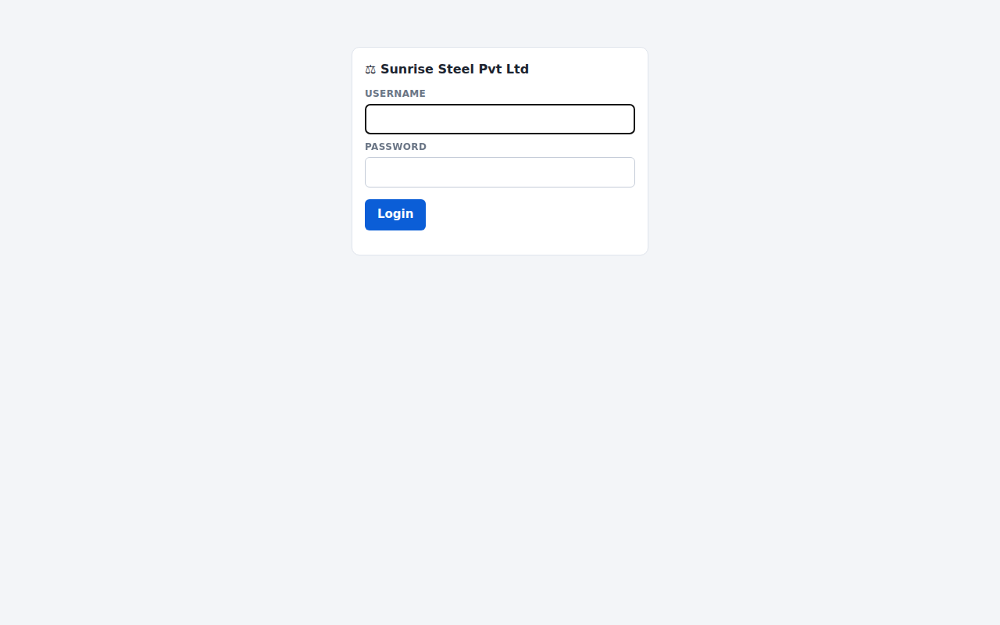

## Step 3 — Company details

*Setup → General*: company name, address (printed on the ticket), ticket prefix (default `WB`, giving numbers such as `WB202609290001`). Tick **Allow manual weight entry** only if you want operators to be able to type a weight when a scale is down (it is flagged on the slip).

## Step 4 — Users

*Setup → Users*: add one **Operator** login per person (never share the administrator login). Minimum password length is 8.

## Step 5 — Connect the real scale(s)

See section 6. Switch the scale from *Simulator* to the real port, test, and save.

## Step 6 — Masters

*Masters*: add your regular **vehicles** (with a **stored tare** if you use single-pass weighing), **parties** and **materials**. New names typed on the weighing or gate screens are added automatically.

## Step 7 — Optional modules

* Cameras / plate recognition: section 7
* Gates and barriers: section 8
* Oracle: section 9

## Step 8 — Acceptance test

Complete the checklist in **Appendix D** before handing over.

---

# 6. Connecting the weighing scales (indicators)

Open **Setup → Scales**. Every scale on this PC is listed with its connection and reader status.

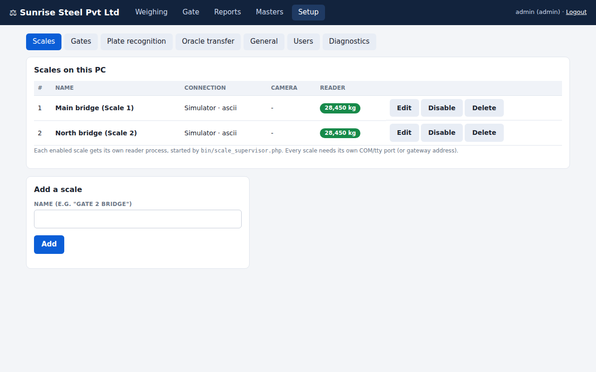

* **Add a scale** creates a new one (disabled, in Simulator mode). Press **Edit**, configure it, tick **Enabled**, and **Save**.
* A scale's reader starts within about two seconds of being enabled; changes to a running scale are picked up within five seconds. No restart is needed.
* Two scales cannot use the same COM port or gateway address.

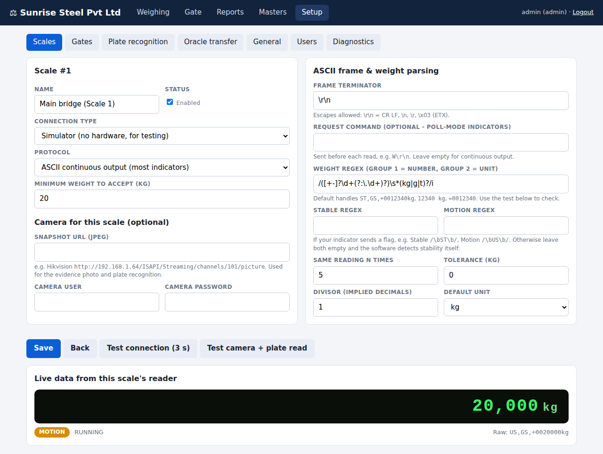

## 6.1 Connection

| Field | Meaning |
|---|---|
| **Connection type** | *Serial* (COM / ttyUSB — RS-232 or RS-485 through a USB adapter), *TCP/IP* (serial-to-Ethernet gateway in "TCP server" mode), or *Simulator*. |
| **Serial port** | Windows `COM3`; Linux `/dev/ttyUSB0` (prefer `/dev/serial/by-id/...`, which does not change after a reboot). |
| **Baud / data bits / parity / stop bits** | Must match the indicator exactly (see its manual). |
| **Protocol** | *ASCII continuous output* (most indicators) or *Modbus RTU* (RS-485 transmitters / load-cell amplifiers). |
| **Minimum weight to accept** | Weights below this are refused (prevents empty-platform tickets). |

## 6.2 ASCII protocol

The indicator sends a line of text many times per second, for example `ST,GS,+0012340kg` followed by CR LF.

| Field | Meaning |
|---|---|
| **Frame terminator** | Character(s) that end each line: `\r\n` (CR LF, most common), `\r`, `\n`, or `\x03` (ETX). |
| **Request command** | Only for indicators that send a weight *when asked*: the command to send (for example `W\r\n`). Leave empty for continuous output. |
| **Weight regex** | A pattern that finds the number (group 1) and unit (group 2) in the line. The default `/([+-]?\d+(?:\.\d+)?)\s*(kg|g|t)?/i` handles most formats. |
| **Stable / Motion regex** | If the indicator marks stability in the text (for example `ST` / `US`), enter e.g. `/\bST\b/` and `/\bUS\b/`. |
| **Same reading N times, tolerance** | If the indicator has no stability flag, the weight is called **stable** when the last *N* readings agree within the tolerance. |
| **Divisor** | Use when the indicator omits the decimal point (`012340` meaning 1234.0 → divisor 10). |
| **Default unit** | Used when the line has no unit. |

## 6.3 Modbus RTU (RS-485)

Slave ID, function (03 holding / 04 input registers), start address (0-based: register 40001 = address 0), one or two registers (16-bit / 32-bit), word order, signed, poll interval. The divisor field (in the ASCII panel) also applies.

## 6.4 Test

1. **Save**, then press **Test connection (3 s)**. You will see the raw characters received (`<0D><0A>` means CR LF) and the weight the system extracted.
2. If "Could not parse a weight" appears, adjust the terminator or regex until the weight is right.
3. The test needs exclusive use of the port. If the scale is already running, the page tells you: either watch the **Live data** panel at the bottom of the page (it shows what the running reader receives), or disable the scale, wait ten seconds, and test.
4. Put a **known weight** on the bridge and confirm the number on the Weighing screen.

## 6.5 Wiring notes

* **RS-232:** indicator TX → PC RX, indicator RX → PC TX, GND ↔ GND. If nothing arrives, swap TX/RX.
* **RS-485:** A→A (D+), B→B (D−). Labels differ between vendors; if there is no data, swap the two wires. Add a 120 Ω resistor at the far end of long cables.
* **Indicator setting:** make sure its serial output is set to *continuous* (or the mode you configured), at the same baud/parity.

---

# 7. Cameras and plate recognition (ANPR)

Plate recognition is **optional**. Without it, the operator types the vehicle number.

## 7.1 Cameras

For every scale (*Setup → Scales → Edit → Camera*) and every gate (*Setup → Gates → Edit → Camera*) you can enter a **snapshot URL** — a web address that returns the current picture as a JPEG — with the camera's user name and password. Typical examples: Hikvision `http://<ip>/ISAPI/Streaming/channels/101/picture`, Dahua `http://<ip>/cgi-bin/snapshot.cgi`. Check your camera manual.

With a camera configured, an **evidence photo** is saved at every first and second weighment and at every gate entry/exit, and shown on the slip / gate pass.

**Camera placement (for plate reading):** 5–8 m from the plate, angle less than 30°, shutter at least 1/500 s, good lighting or infra-red at night, no headlight glare.

## 7.2 Recognition service

*Setup → Plate recognition*. Choose a provider:

| Provider | Notes |
|---|---|
| **CodeProject.AI Server** | Free, runs on your own PC or server. Install it and its ALPR module; URL `http://127.0.0.1:32168/v1/vision/alpr`. |
| **Plate Recognizer** | Commercial. Cloud service (needs internet and an API token) or their on-premises container. |
| **Local command** | Any program that prints the plate as JSON or as `PLATE` / `PLATE 0.93`, for example OpenALPR: `alpr -c in -n 1 -j {image}`. Run without a shell for safety. |

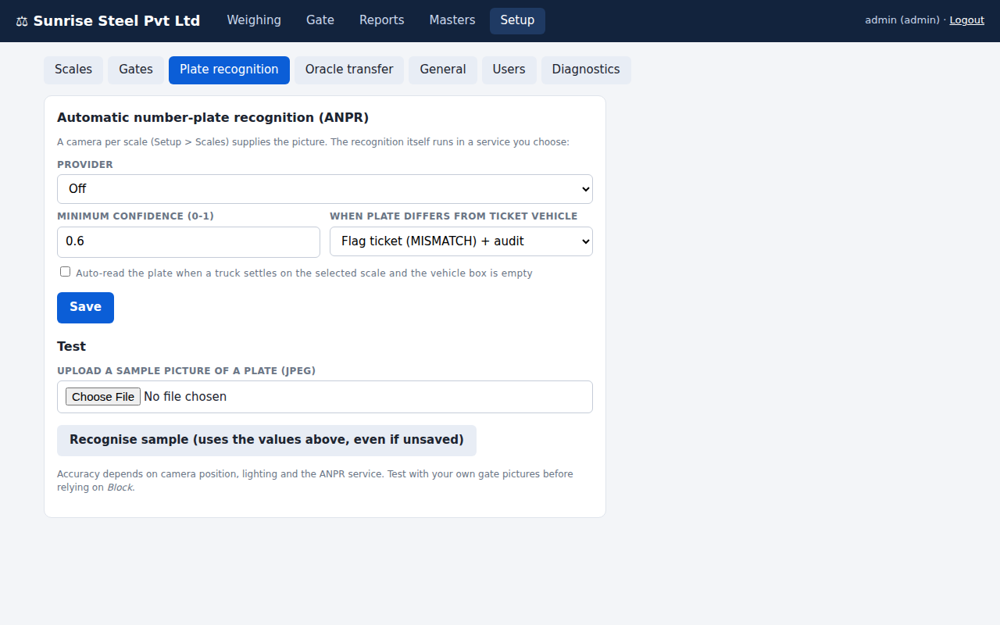

* **Minimum confidence** (default 0.6): a plate read below this is treated as *unread* rather than risk a wrong number.
* **When the plate differs from the ticket vehicle:** *Ignore*, *Flag ticket* (recorded as MISMATCH, audit entry), or *Block* (an administrator must tick **Override**).
* **Auto-read:** when a truck settles on the selected scale and the vehicle box is empty, the plate is read automatically.
* **Test:** upload a sample photo of a plate and press *Recognise sample* — it works with unsaved values. On a scale's page, **Test camera + plate read** checks the real camera.

## 7.3 How it is used

* **Read** button next to the vehicle number: fills the number, tells you whether the vehicle is known, its stored tare, and whether it already has an open ticket (or is on the block list, at the gate).
* On the **second weighment** the system checks that the truck on the bridge is the truck on the ticket.
* Results are stored on the ticket/pass and shown as **OK**, **MISMATCH**, **UNREAD** (plate not readable) or **NOIMG** (no camera picture).
* Plate comparison ignores spaces and dashes and look-alike characters (0/O, 1/I, 5/S, 8/B, 2/Z), and tolerates one wrong character on plates of six or more characters.
* A camera or recognition failure **never stops a weighing** — the ticket is created and flagged.

> **Advice:** test on your own pictures first and start with *Flag*, not *Block*.

---

# 8. Gates and boom barriers

## 8.1 Safety first

> The program only sends a momentary **contact** (like a remote-control button press) to the barrier controller. It cannot see the barrier and does **not** provide anti-crush protection.
>
> * Fit the barrier's own **safety loop / photocell / limit switches / emergency stop** as required.
> * Connect through a **dry-contact relay** to the controller's OPEN/CLOSE inputs. Never connect PC outputs directly to a motor circuit.
> * **Auto-close** is **off** by default. Use it only when a safety loop is fitted.
> * Test with people and vehicles clear of the barrier.
> * The status badge shows the **last command sent**, not the real barrier position.

## 8.2 Configure a gate

*Setup → Gates → Add a gate → Edit*.

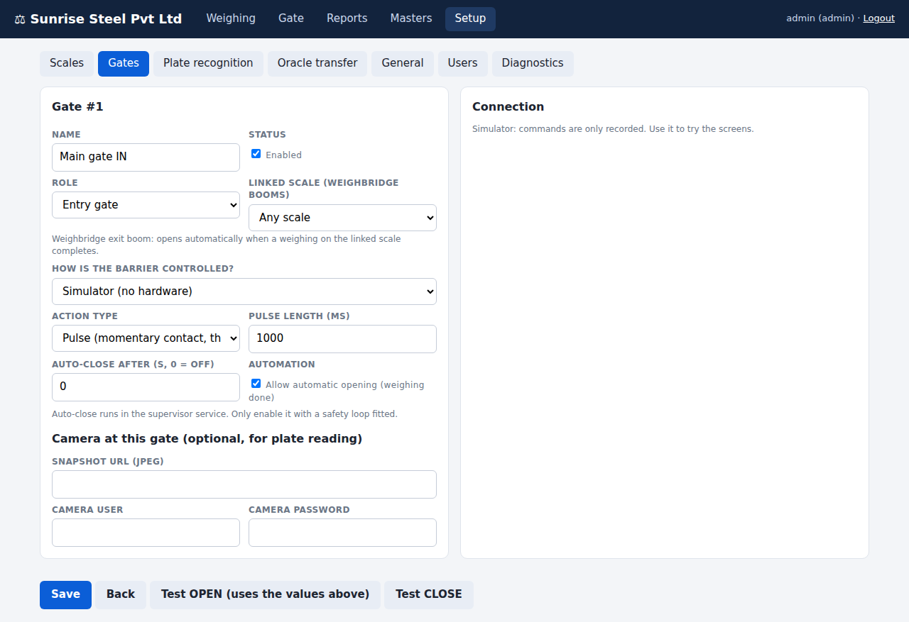

| Field | Meaning |
|---|---|
| **Role** | *Entry gate* / *Exit gate* (used at the security gate), *Weighbridge entry boom*, *Weighbridge exit boom*. |
| **Linked scale** | For a weighbridge exit boom: which scale it belongs to (or "Any"). |
| **Action type** | **Pulse** (momentary contact, then released — most barrier controllers) or **Latched** (relay stays on until the next command). |
| **Pulse length** | Milliseconds the contact is held (typical 500–1000). |
| **Auto-close after** | Seconds after OPEN before a CLOSE is sent (0 = never). Performed by the scale supervisor service, which must be running. |
| **Allow automatic opening** | Lets the system open this gate by itself (weighbridge exit boom opens when a weighing completes). |

**How the barrier is controlled**

| Hardware | Driver | Typical settings |
|---|---|---|
| IP relay, Shelly, ESP relay, barrier with web API | **HTTP** | Open URL, Close URL, Release URL (optional), method GET/POST/PUT, optional user/password and body. Success = HTTP 2xx. Example Shelly: open `http://<ip>/relay/0?turn=on`, release `http://<ip>/relay/0?turn=off`. |
| Ethernet relay board | **TCP** | Host, port, open / close / release commands as text (`OPEN\r\n`) or hex (`hex:A0 01 01 A2`). |
| USB / RS-232 relay board | **Serial** | Its own COM port, baud (usually 9600); commands as hex, e.g. open `hex:A0 01 01 A2`, release `hex:A0 01 00 A1`. |
| RS-485 relay module / PLC | **Modbus RTU** | Slave ID, open coil, optional close coil. Needs its own adapter. |
| PLC / Ethernet I/O module | **Modbus TCP** | Host, port 502, unit ID, coils. |
| — | **Simulator** | Commands are only recorded; for training. |

Modbus coils: *one coil, latched* = ON opens, OFF closes. *Two coils, pulse* = each coil is pulsed.

A gate relay cannot share a COM port with a scale. Two gates may share one relay board (different channels).

Use **Test OPEN / Test CLOSE** in the editor (it works before you save) and watch the barrier.

## 8.3 The Gate screen

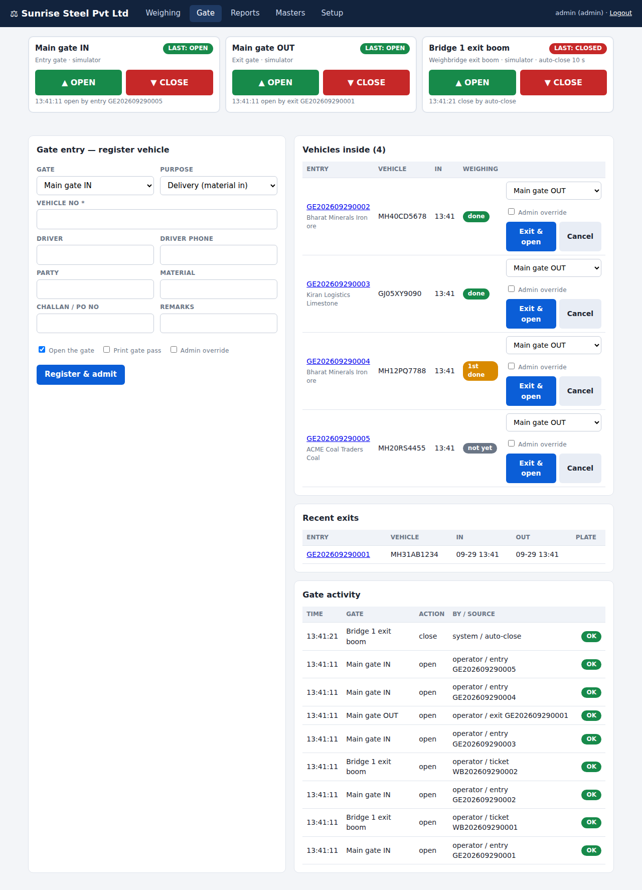

1. **Gate cards** — big **OPEN** and **CLOSE** buttons. Every press is logged (who, when, result). If the relay does not answer, the card shows the failure and the state does not change.
2. **Gate entry — register vehicle** (section 11).
3. **Vehicles inside** and **Recent exits**.
4. **Gate activity** — the last commands, including automatic ones (`auto-close`, `ticket WB…`, `entry GE…`).

## 8.4 Automatic actions

| Event | Automatic action |
|---|---|
| Vehicle registered at an entry gate (with "Open the gate" ticked) | Entry gate opens |
| Vehicle exits (with "Exit & open") | Exit gate opens |
| Second weighment (or single-pass ticket) completes on a scale | Weighbridge exit boom linked to that scale opens (if "Allow automatic opening" is ticked) |
| Auto-close time passes | Gate closes |

A barrier fault **never** blocks or undoes a weighing — the failure is shown in Gate activity.

## 8.5 Gate rules

*Setup → Gates → Gate entry rules*:

* **Weighing requires a gate entry** — *No* / *Warn* / *Yes – block* (an administrator can override).
* **Exit requires completed weighment and no open ticket** — *No* / *Warn* / *Yes – block*.

---

# 9. Oracle database integration

## 9.1 What is sent

Every **completed** (closed) ticket, and every **cancelled** ticket that was already sent, is transferred to one Oracle table (default `WEIGHBRIDGE_TICKETS`). The transfer uses an Oracle `MERGE` on the ticket number, so a ticket that is sent twice updates the same row — **no duplicates**. If Oracle or the network is down, tickets simply wait (status *PENDING*) and are sent automatically when it returns. Weighing is never interrupted.

## 9.2 Prepare Oracle

1. Run `sql/oracle_schema.sql` in the schema that will own the table (creates `WEIGHBRIDGE_TICKETS`, primary key `TICKET_NO`, two indexes).
2. Create a dedicated user with only `CREATE SESSION` and `SELECT, INSERT, UPDATE` on that table.
3. If you created the table with an earlier script, run the `ALTER TABLE` statement at the bottom of the file to add `SCALE_NAME`, `PLATE_IN`, `PLATE_OUT`, `PLATE_FLAG`.
4. Make sure the weighbridge PC can reach the listener (default port 1521).

## 9.3 Prepare the PC

Install **Oracle Instant Client (Basic)** matching PHP's 32/64 bit, and the PHP **oci8** extension (README step 6 has the exact Windows and Linux commands). Check with `php -m` that `oci8` is listed, and run `php bin/check.php`.

## 9.4 Configure

*Setup → Oracle transfer*: host, port, **service name** (not SID), user, password (stored encrypted), table name, batch size. Press **Test Oracle connection** (it also checks that the table exists), tick **Enable automatic transfer**, and **Save**. The *WeighbridgeOracleSync* service (or `bin/sync_oracle.php --loop=30`) performs the transfer.

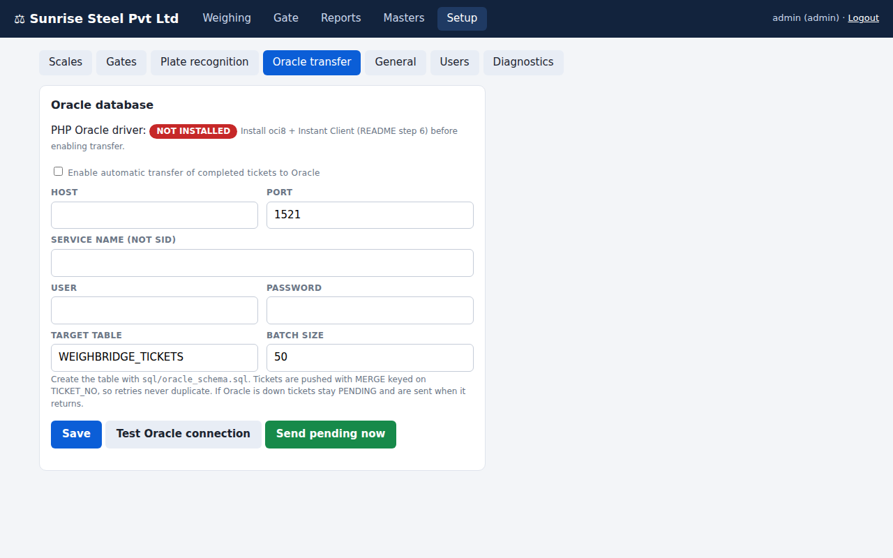

## 9.5 Monitoring

* *Reports* shows the Oracle status of each ticket: **PENDING** (waiting), **SYNCED**, **FAILED** (hover for the Oracle error), **NA** (Oracle not enabled).
* Administrators can press **Send to Oracle now** or **Re-queue failed**.
* *Setup → Diagnostics* shows the number waiting and the last error.
* `http://<server>/api/health.php` returns `503` when a scale reader is not running — use it with your monitoring system.

## 9.6 Columns

See Appendix B.

---

# 10. Daily operation — weighbridge operator

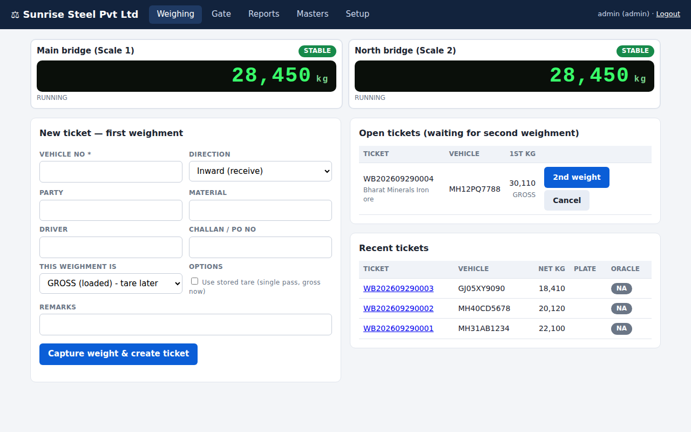

## 10.1 The screen

* At the top, one **live display per scale**: weight in kg and a badge **STABLE** (green), **MOTION** (amber) or **NO DATA** (red). Click the display of the bridge you are standing at; the choice is remembered on that PC.
* The **capture buttons are disabled until the weight is stable**. The weight recorded is the one the system holds at the moment you press the button — it cannot be typed or altered in the browser.
* Left: **New ticket**. Right: **Open tickets** (waiting for the second weighment) and **Recent tickets**.

## 10.2 Normal two-pass weighing (inward)

1. Truck drives onto the bridge. Wait for **STABLE**.
2. Enter the **vehicle number** (or press **Read** to read the plate). Choose party and material; driver and challan are optional.
3. Leave *This weighment is* = **GROSS (loaded) – tare later** for a loaded truck arriving, or choose **TARE (empty)** for an empty truck arriving to load.
4. Press **Capture weight & create ticket**. The ticket appears under *Open tickets*.
5. Truck goes away, unloads or loads, and returns.
6. On the returning truck's row press **2nd weight** (with the truck stable on a scale — it can be a different bridge; select it at the top).
7. The slip opens. The system computes **Net = Gross − Tare**, shows all values, and prints on **Print**. The weighbridge exit boom opens if configured.

The system refuses a second weighment if Gross is not greater than Tare (wrong first-weight type) — cancel the ticket (administrator) and redo.

## 10.3 Single-pass weighing (stored tare)

For vehicles whose empty weight is stored in *Masters*: tick **Use stored tare (single pass, gross now)**, capture the loaded weight; the ticket is completed immediately. The stored tare is learned automatically from the first two-pass weighing of a vehicle.

## 10.4 Slip

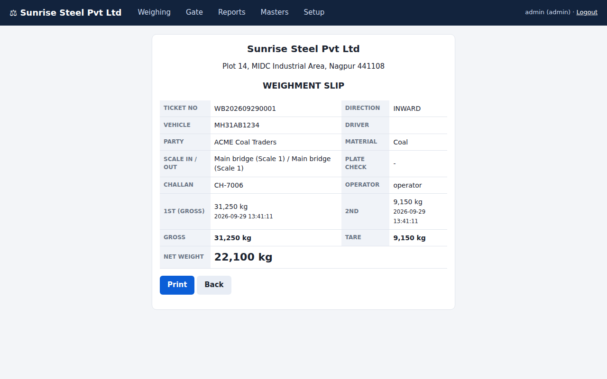

## 10.5 Messages you may see

| Message | Meaning / action |
|---|---|
| "Weight is not stable yet" | Wait for the STABLE badge. |
| "No live weight … reader stopped or scale disconnected" | Check the indicator and cable; ask the administrator to look at *Setup → Scales*. |
| "Weight … is below the minimum capture weight" | Platform empty or truck partly off the bridge. |
| "Vehicle … already has an open ticket" | Use **2nd weight** on the open ticket instead of creating a new one. |
| "Gross must be greater than tare" | The first-weight type was wrong; administrator cancels and redoes. |
| "Camera read plate X but the ticket vehicle is Y" | Plate check (block mode): confirm the vehicle number; only an administrator can override. |
| "Vehicle … has no gate entry" | Gate rule: register the vehicle at the gate first (or administrator override). |

## 10.6 If the scale is down

If the administrator has allowed **manual weight entry**, a *Manual weight* box appears; enter the weight from another source. Such weights are marked *(manual)* on the slip and should be exceptional.

## 10.7 Cancelling

Only an administrator can **Cancel** an open ticket (a reason is required and is recorded).

---

# 11. Daily operation — security gate

Open the **Gate** screen.

## 11.1 Admitting a vehicle

1. Choose the **entry gate** and **purpose** (delivery, dispatch, visitor/other, empty/returning).
2. Enter the **vehicle number**, or press **Read** to read it from the gate camera. The note under the field tells you if the vehicle is *known*, *new*, **blocked**, or **already inside**.
3. Fill in driver, phone, party, material, challan.
4. Leave **Open the gate** ticked; tick **Print gate pass** if you want a printout.
5. Press **Register & admit**.

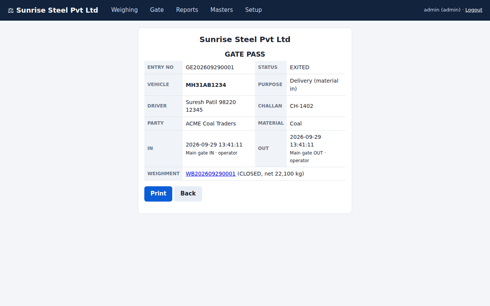

**Refusals:** a vehicle that is already inside, or on the **block list**, is refused and the gate stays closed (the attempt is recorded). An administrator can admit a blocked vehicle by ticking *Admin override*; this is noted on the pass.

## 11.2 Vehicles inside

The list shows every vehicle currently inside with its **weighing status**: *not yet*, *1st done* (loaded/empty weight taken, second pending) or *done*.

## 11.3 Letting a vehicle out

1. Find the vehicle under *Vehicles inside*.
2. Check the exit gate in the drop-down and press **Exit & open**.
3. If the exit rule is set to *block*, the exit is refused while the vehicle still has an **open ticket** or (for delivery/dispatch) **no completed weighment**. The message says which. An administrator may override; it is recorded on the pass.

## 11.4 Opening or closing a barrier manually

Press **OPEN** or **CLOSE** on the gate's card. The result appears under the buttons and in *Gate activity*. Use manual buttons for staff, emergency vehicles and testing.

## 11.5 Blocking a vehicle

*Masters → Vehicles → Block* (administrator): enter a reason. The vehicle is refused at the gate until unblocked.

---

# 12. Reports, tickets and the ERP interface

## 12.1 Reports

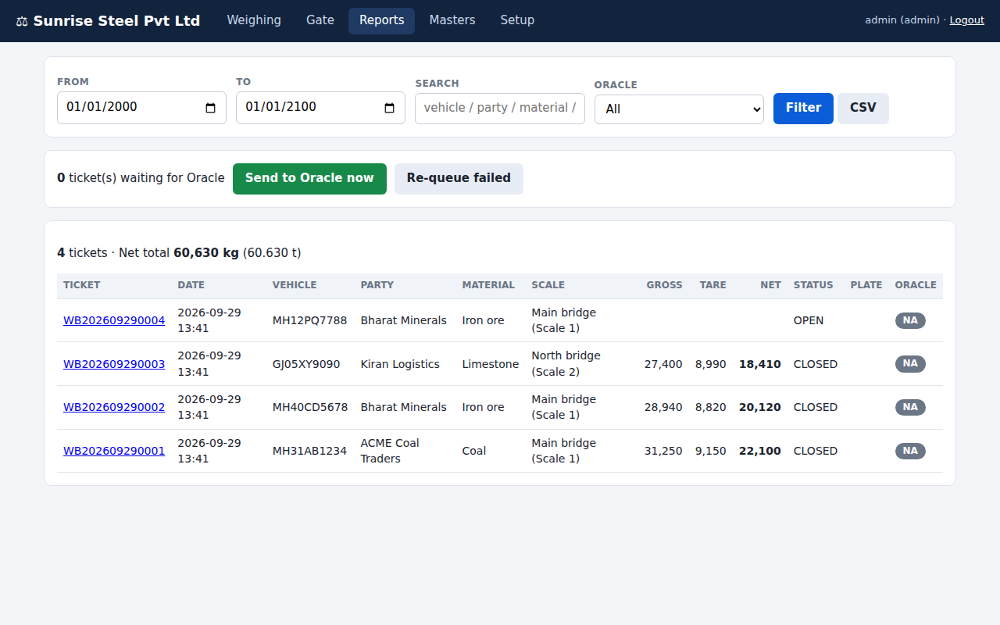

*Reports* lists tickets for a date range with search (vehicle, party, material, ticket number) and an **Oracle** filter. It shows totals in kg and tonnes for completed tickets, plate check result, scale, and Oracle status. **CSV** downloads the filtered list for Excel. Click a ticket number to view or reprint the slip.

## 12.2 Masters

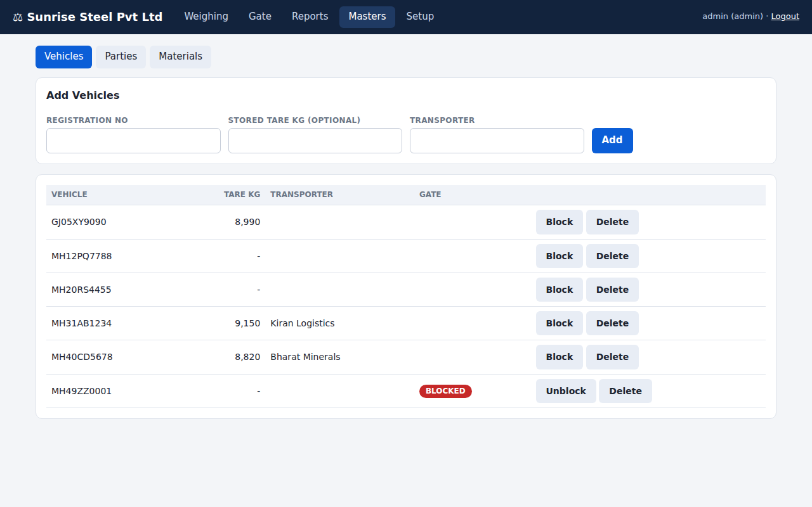

Vehicles (registration, **stored tare**, transporter, blocked flag), parties and materials. Add anyone; administrators can delete and block.

## 12.3 ERP interface (read-only REST API)

*Setup → General → ERP REST API → Generate new token* (the token is shown **once**; store it safely; it is kept only as a hash). Your ERP then calls:

```
GET http://<server>/api/v1/tickets.php?since_id=0&limit=100
Authorization: Bearer <token>
```

It returns completed and cancelled tickets with `id` greater than `since_id` (maximum 500 per call) as JSON. The ERP remembers the highest `id` received and asks for newer ones next time. *Disable API* revokes access.

---

# 13. Administration

## 13.1 Users

*Setup → Users*: add users, enable/disable, set passwords. The administrator cannot disable their own login. After 8 failed logins for a user name or address, further attempts are refused for 10 minutes.

## 13.2 Backups — **do this daily**

```
php bin/backup.php --dir=D:\Backups\weighbridge --keep=30
```

Creates a consistent copy of the database (safe while the system is running), verifies it, and keeps the newest 30. Schedule it daily: Windows *Task Scheduler*, or Linux cron `15 2 * * * php /var/www/weighbridge/bin/backup.php --dir=/backup/weighbridge --keep=30`.

Also keep a separate copy of **`data/app.key`** — without it the saved Oracle, camera and relay passwords cannot be decrypted (you would re-enter them). Copy the `data/snapshots` folder if you need to keep evidence photos.

## 13.3 Restoring / moving to another PC

1. Install the program on the new PC (section 4) but do not run the installer page.
2. Stop the services. Copy your backup file to `data/weighbridge.sqlite` (delete any `weighbridge.sqlite-wal/-shm` files) and copy `app.key` to `data/`.
3. Run `php bin/check.php`, start the services, log in.
4. Re-check the COM port names in *Setup → Scales / Gates* (they can differ on a new PC).

## 13.4 Upgrading to a new version

1. Take a backup (13.2).
2. Stop the services.
3. Copy the new program files over the old ones, **keeping the `data` folder**.
4. Run `php bin/check.php`, then start the services. The database upgrades itself automatically the first time it is opened.
5. Optional: `php tests/run.php` runs the self-tests in a temporary folder (it never touches your data).

## 13.5 Logs and health

| What | Where |
|---|---|
| Reader logs (one per scale) | `data/logs/scale_<n>.log` (rotated at 5 MB) |
| Supervisor / service messages | Linux: `journalctl -u weighbridge-scale`; Windows: `data\scale.log` |
| Audit trail (logins, tickets, cancels, overrides, setup changes) | *Setup → Diagnostics → Recent audit* |
| Gate commands | *Gate → Gate activity* |
| System status | *Setup → Diagnostics*, and `api/health.php` |

Camera photos in `data/snapshots` are never deleted automatically; remove old ones according to your retention policy.

## 13.6 Time and date

Tickets use the PC clock and timezone. The default timezone is `Asia/Kolkata`; change it by setting the environment variable `WB_TZ` (for example `WB_TZ=Africa/Nairobi`) for the services.

---

# 14. Security

* Passwords are stored as one-way hashes. Oracle, camera and relay passwords and the plate-recognition token are stored **encrypted** (key in `data/app.key`).
* Every form is protected against cross-site request forgery; every database query is parameterised; browser security headers are set; repeated failed logins are locked out.
* Weights are captured **on the server** from the reader; the browser cannot supply a weight (except the optional, flagged manual entry).
* Setup, user management, overrides and cancellations are administrator-only and audited.
* Serial port names and network addresses entered in Setup are validated so they cannot be used to run commands.
* **Recommendations:** keep the PC on a protected network; use HTTPS (reverse proxy) if the screens are reachable beyond the plant network; use individual logins; back up daily; restrict who can open the `data` folder; fit the barrier's hardware safety devices.

---

# 15. Troubleshooting

First run `php bin/check.php` and look at *Setup → Diagnostics*.

| Symptom | Likely cause and fix |
|---|---|
| Display shows `---`, badge **NO DATA** | Reader not running (start the service / `start.bat`), wrong port or settings, cable. Use *Setup → Scales → Test connection*. |
| "Serial device not found" / "stty failed" | Wrong port name; on Linux add the service user to `dialout`; unplug and re-plug the adapter. |
| Test: port opens but no data | TX/RX swapped (RS-232), A/B swapped (RS-485), wrong baud/parity, indicator not in continuous mode (use *Request command*). |
| Bytes arrive but "could not parse a weight" | Fix terminator (`\r`, `\n`, `\r\n`, `\x03`) and weight regex. |
| Weight never becomes STABLE | Enter the indicator's stable flag in the Stable regex, or raise tolerance / lower "same reading N times". |
| Value 10× too large or small | Set **Divisor** (10, 100…). |
| Modbus: "short/no response" | Slave ID, baud/parity, A/B wiring, address base (0-based). |
| Modbus: CRC error | Baud/parity mismatch, noise, missing terminator resistor. |
| Windows: port busy | Another program (the indicator's own utility) holds the COM port. |
| Scale shows "Reader not running" | Supervisor service stopped, or the scale is not Enabled. |
| "already uses COM3" when saving | Each scale/gate relay needs its own serial port. |
| Camera test: "No JPEG from the camera URL" | Wrong snapshot URL/credentials, camera unreachable, `curl` extension disabled. |
| Plate always UNREAD / NOIMG | Camera or service problem (use the test buttons), poor picture, confidence threshold too high. |
| Many MISMATCH flags | Camera angle/lighting; set policy to *Flag*; try another provider. |
| Gate button: "relay unreachable" / "did not reply" | Wrong IP/port/COM, wiring, slave ID; use *Test OPEN* in Setup → Gates. For Modbus boards that never answer, untick *Require echo reply*. |
| Log says OK but the barrier does nothing | Wrong relay channel/coil, or the controller needs a longer pulse. |
| Gate did not auto-close | Supervisor not running, or auto-close is 0. |
| "No Oracle PHP driver" | Install oci8 + Instant Client (section 9.3); check `php -m` for the same PHP the services use. |
| `ORA-12541` / `ORA-12514` | Listener host/port or **service name** wrong. |
| `ORA-00942` | Table missing or no rights: run `sql/oracle_schema.sql`, grant rights. |
| Tickets stay PENDING | Oracle sync service not running or Oracle unreachable — see *Diagnostics*. |
| "Too many failed logins" | Wait 10 minutes, or ask another administrator. |
| Screens load but look unstyled / links 404 | Web server is not pointing at the `public` folder. |

**When you ask for support, please send:** the output of `php bin/check.php`, a screenshot of *Setup → Diagnostics*, the last lines of `data/logs/scale_<n>.log`, the exact message on screen, and the indicator model with its serial output settings.

---

# 16. Appendices

## Appendix A — Settings reference

| Setting | Where | Default |
|---|---|---|
| Company name / address / ticket prefix | General | `My Weighbridge` / — / `WB` |
| Allow manual weight | General | off |
| Connection type, port, baud, data bits, parity, stop bits | Scales | Simulator; 9600, 8, N, 1 |
| Protocol, terminator | Scales | ASCII; `\r\n` |
| Weight regex | Scales | `/([+-]?\d+(?:\.\d+)?)\s*(kg|g|t)?/i` |
| Stable regex / motion regex | Scales | empty (use repeated readings) |
| Same reading N times / tolerance | Scales | 5 / 0 kg |
| Divisor | Scales | 1 |
| Minimum weight | Scales | 20 kg |
| Camera URL, user, password | Scales, Gates | empty |
| Gate driver / mode / pulse / auto-close / automatic opening | Gates | Simulator / pulse / 1000 ms / 0 / on |
| ANPR provider, URL, token, region | Plate recognition | off |
| ANPR minimum confidence / policy / auto-read | Plate recognition | 0.6 / flag / off |
| Weighing requires gate entry / exit rule | Gates | off / warn |
| Oracle host, port, service, user, password, table, batch | Oracle transfer | — / 1521 / — / — / — / `WEIGHBRIDGE_TICKETS` / 50 |

## Appendix B — Oracle table `WEIGHBRIDGE_TICKETS`

| Column | Type | Content |
|---|---|---|
| `TICKET_NO` | VARCHAR2(30), primary key | Ticket number, e.g. `WB202609290001` |
| `VEHICLE_NO` | VARCHAR2(30) | Vehicle registration |
| `PARTY`, `MATERIAL`, `DIRECTION`, `DRIVER`, `CHALLAN_NO`, `REMARKS` | VARCHAR2 | As entered (`DIRECTION` = INWARD / OUTWARD) |
| `GROSS_KG`, `TARE_KG`, `NET_KG` | NUMBER(12,2) | Weights in kg |
| `FIRST_WEIGHT_AT`, `SECOND_WEIGHT_AT` | TIMESTAMP | Local time of each weighment |
| `STATUS` | VARCHAR2(12) | `CLOSED` or `CANCELLED` |
| `OPERATOR` | VARCHAR2(50) | User who created the ticket |
| `LOCAL_ID` | NUMBER(12) | Record number in the weighbridge database |
| `SCALE_NAME` | VARCHAR2(100) | Scale used for the first weighment |
| `PLATE_IN`, `PLATE_OUT`, `PLATE_FLAG` | VARCHAR2 | Plates read, and OK / MISMATCH / UNREAD / NOIMG |
| `SYNCED_AT` | TIMESTAMP | When the row was written |

## Appendix C — Indicator output examples

These are only **examples of the kind of line** indicators send. Always check your indicator's manual and use *Test connection* to see what yours really sends.

| Line received (each ends with CR LF) | Works with the default regex? | Note |
|---|:-:|---|
| `ST,GS,+0012340kg` | ✔ | Enter Stable regex `/\bST\b/` and Motion regex `/\bUS\b/` if the line begins with ST/US |
| `   12340 kg` | ✔ | |
| `=0012340` | ✔ | Unit defaults to kg |
| `012340` meaning 1234.0 kg | ✔ number, ✘ scale | Set **Divisor** to 10 |
| `W 1.5 t` | ✔ | Converted to 1500 kg |
| Frame `<STX> 5000 kg <ETX>` | ✔ | Terminator `\x03` |

## Appendix D — Commissioning and acceptance checklist

| | | | |
|---|---|---|---|
| **Site** | &nbsp; | **Date** | &nbsp; |
| **Engineer** | &nbsp; | **Client witness** | &nbsp; |


| # | Test | Result |
|---|---|:-:|
| 1 | `php bin/check.php` shows no `[FAIL]` | ☐ |
| 2 | Installer completed; administrator and operator logins work | ☐ |
| 3 | Services start automatically after a PC restart (readers, web, Oracle sync) | ☐ |
| 4 | Each scale displays the correct weight; empty bridge reads 0 (or below minimum) | ☐ |
| 5 | Known test weight placed on each bridge reads correctly | ☐ |
| 6 | STABLE appears only when the weight is really steady; buttons are disabled during MOTION | ☐ |
| 7 | Two-pass ticket: gross, tare and net are correct; slip prints | ☐ |
| 8 | Single-pass ticket with stored tare is correct | ☐ |
| 9 | Second weighment on a different bridge works | ☐ |
| 10 | Unplugging the indicator shows NO DATA within 3 s and blocks capture | ☐ |
| 11 | Camera test returns a picture; photo appears on the slip | ☐ |
| 12 | Plate recognition reads at least 8 of 10 real vehicles (or is left off) | ☐ |
| 13 | Each gate: Test OPEN and Test CLOSE move the barrier (people clear); barrier's safety devices verified | ☐ |
| 14 | Gate entry → weighing → exit works; exit refused with an open ticket (if rule is on) | ☐ |
| 15 | Blocked vehicle is refused at the gate | ☐ |
| 16 | Oracle test succeeds; a ticket appears in Oracle with correct values and status SYNCED | ☐ |
| 17 | Oracle down for a while: weighing continues, tickets are sent when it returns | ☐ |
| 18 | Report and CSV export match the slips | ☐ |
| 19 | Backup taken and a test restore checked; `app.key` copied elsewhere | ☐ |
| 20 | Operators trained; administrator password handed over securely | ☐ |

## Appendix E — Main database tables (SQLite)

`weighments` (tickets), `gate_entries` (gate passes), `vehicles`, `parties`, `materials`, `scales`, `live_scale` (current readings), `gates`, `gate_state`, `gate_events`, `users`, `settings`, `audit`, `login_attempts`. The file is `data/weighbridge.sqlite`; it can be opened read-only with any SQLite tool for your own reports. Please do not edit it while the system is running.

## Appendix F — Glossary

| Term | Meaning |
|---|---|
| **Gross / Tare / Net** | Loaded weight / empty weight / material weight (Gross − Tare). |
| **Indicator** | The display unit connected to the load cells; it sends the weight to the PC. |
| **RS-232 / RS-485** | Serial connections. RS-485 uses two wires and works over long distances and multiple devices. |
| **Modbus** | A common industrial protocol used by transmitters, relays and PLCs. |
| **Stable** | Weight is steady (no motion), safe to record. |
| **ANPR** | Automatic number-plate recognition. |
| **Boom barrier** | The gate arm at the entry, exit or weighbridge. |
| **Pulse** | A short contact closure, like pressing a remote-control button. |
| **Reader / supervisor** | Background programs that read a scale / that keep all readers running. |
| **Store-and-forward** | Records are kept locally and sent when the destination is available. |

---

*End of manual — Weighbridge Management System v1.0.0*
